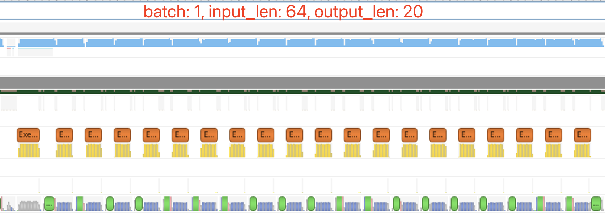
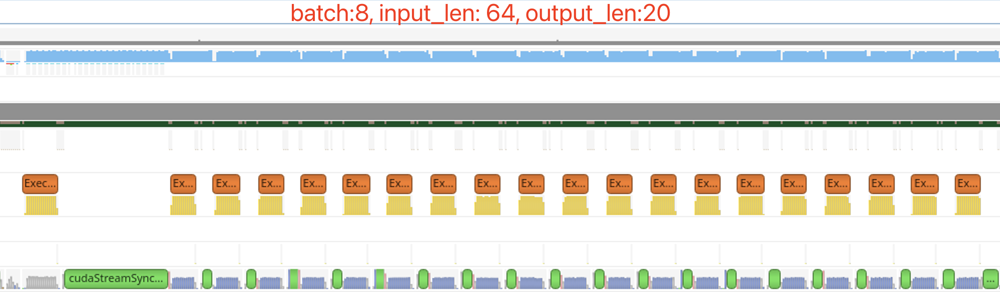
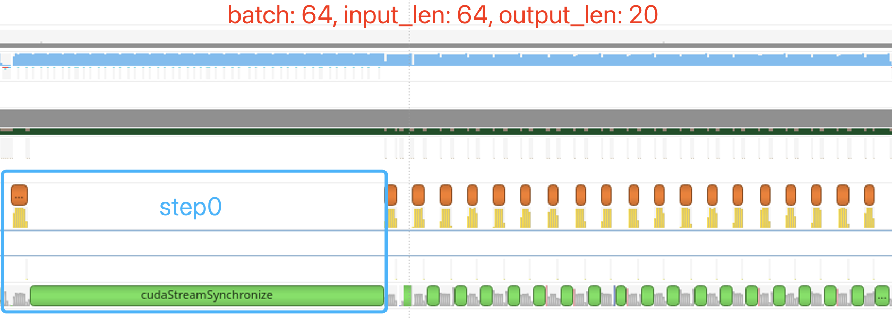
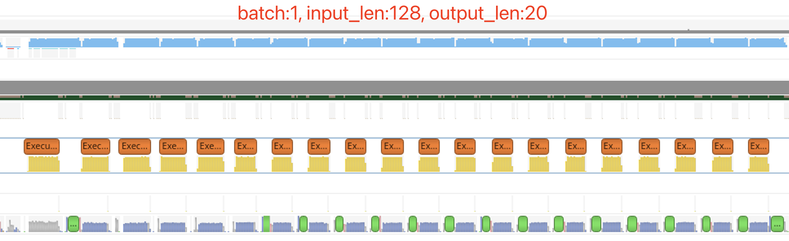
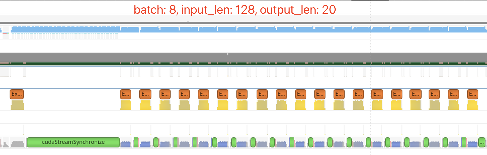
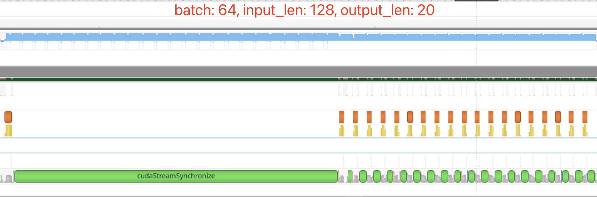
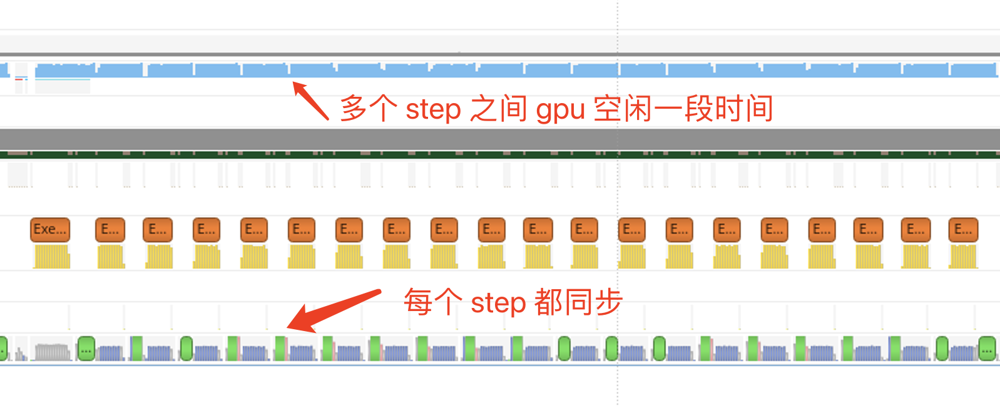
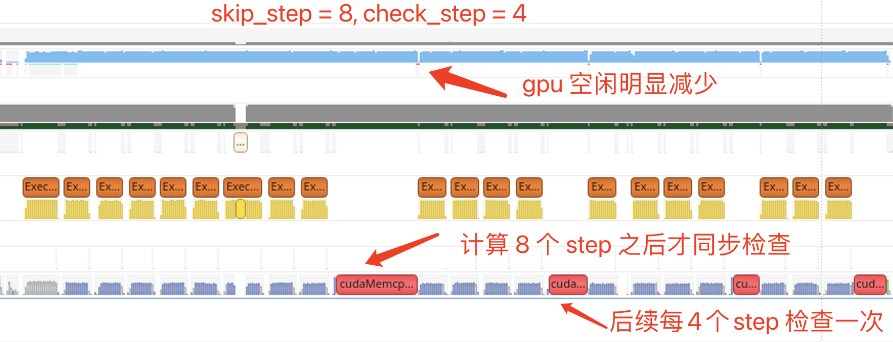

### 总述

- 选题：本次复赛选题为 [NVIDIA TensorRT Hackathon 2023](https://github.com/NVIDIA/trt-samples-for-hackathon-cn/tree/master/Hackathon2023) 选题3: 用TensorRT-LLM 优化 examples 目录下的 GPT 模型
- 优化效果：
- 在Docker里面代码编译、运行步骤的完整说明
  - 请做到只要逐行运行你给的命令，就能把代码跑起来

### 主要开发工作

#### 开发工作的难点

请在这一节里总结你的工作难点与亮点。
- 如果使用 TensorRT 进行优化，请介绍一下在模型在导出时、或用polygraphy/trtexec解析时，或在使用TensorRT中，遇到了什么问题并解决了。换句话说，针对这个模型，我们为什么需要额外的工程手段。
- 如果使用 TensorRT-LLM 进行优化，描述以下方面可供选手参考：如果搭建了新模型， 请介绍模型结构有无特别之处，在模型的搭建过程中使用了什么算子，有没有通过plugin支持的新算子。如果支持新feature，请介绍这个feature具体需要修改哪些模块才能实现。如果优化已有模型，请介绍模型性能瓶颈以及解决方法。另外还可以包含工程实现以及debug过程中的难点。

### 开发与优化过程

#### 1、分析模型耗时
在进行优化之前，首先需要定位出优化点。这个时候需要跑一些 benchmark 以及通过 nsys 对整体耗时及具体 kernel 耗时进行一些分析。

GPT 的计算过程可以将第一次计算（context）和后续自回归解码（generation）区别开来。第一次计算时为整个 input_length 个 tokens 作为输入，input_length 的大小会影响计算耗时。后续自回归解码每个请求输入为 1 个 token（此处取 beam 为 1），循环 output_length 次。用 ```Tctx``` 来标记第一次计算耗时，```Tgen``` 来标记自回归解码一个 token 的耗时。不考虑KV 累积导致 ```Tgen``` 轻微增加的情况，则整个解码的耗时 ```T = Tctx + output_length * Tgen```

#### 1.1 benchmark

使用 ```benchmarks/benchmark.py``` 跑一下 gpt_350m 模型在不同参数下的性能，

- 运行如下命令：

```python benchmark.py -m gpt_350m --mode plugin --batch_size "1;8;16;32;64" --input_output_len "60,20;128,20;60,120;128,120" --output_dir gpt2```

- 结果如下表所示：

|  batch   | input_length  | output_length | tokens_per_sec | latency(ms) |
|  ----  | ----  | ----| ---- | ---- |
| 1  | 64 | 20 | 386.56 | 51.74 |
| 8  | 64 | 20 | 2593.23 | 61.70 |
| 16  | 64 | 20 | 4384.88 |  72.98 |
| 32  | 64 | 20 | 6840.90 |  93.56 |
| 64  | 64 | 20 | 8639.60 |  148.16 |
| 1  | 128 | 20 | 373.96 | 53.48 |
| 8  | 128 | 20 | 2215.36 | 72.23 |
| 16  | 128 | 20 |  3505.70 |  91.28 |
| 32  | 128 | 20 | 4747.70 |  134.80 |
| 64  | 128 | 20 | 5722.28 |  223.69 |
| 1  | 64 | 120 | 393.02 | 305.33 |
| 8  | 64 | 120 | 2764.54 | 346.88 |
| 16  | 64 | 120 | 5002.83  |  383.78 |
| 32  | 64 | 120 | 8524.22 |  450.48 |
| 64  | 64 | 120 | 11932.40 |  643.63 |
| 1  | 128 | 120 | 382.07 | 314.08 |
| 8  | 128 | 120 | 2588.72 | 370.84 |
| 16  | 128 | 120 | 4532.15 |  423.64 |
| 32  | 128 | 120 | 7178.17 |  534.96 |
| 64  | 128 | 120 | 9635.28 |  797.07 |

从表中我们可以看出如下信息：

- batch 从 1 增加到 64 的过程中 tokens_per_sec 一直在增加，即服务的吞吐在增加。batch 由 32 增加到 64 时延迟并没有翻倍，说明整个系统并没有达到 compute-bound 的状态。原因可能在于自回归解码时计算量还不够大。上表中 beam 为 1，当 beam 增大时可能会出现 compute-bound 的情况。
- batch 从 1 变为 8 的时候，延迟只有轻微的增加。进一步说明了在 batch 很小的时候，整个系统处于一种 memory-bound 的状态。
- 在 output_length 为 20 的时候（自回归循环次数少的时候），input_length 从 60 变为 128 的时候，延迟的变化还与 batch 相关。
  - 在 batch 较小时，input_length 从 60 变为 128 对延迟影响不大。说明 batch 较小时 ```Tctx``` 部分的计算还是 memory-bound，主要耗时都花在读取权重上了。
  - 在 batch 较大时，input_length 从 60 变为 128 对延迟影响不大。说明此时 ```Tctx``` 部分的计算已经开始转变为 compute-bound。同时也说明 ```Tctx``` 在  ```T``` 中占比较大。
- 在 output_length 为 120 的时候，input_length 从 60 变为 128 对延迟的影响很小。这也说明此时即使 ```Tctx``` 变为 compute-bound，但 ```Tctx``` 在 ```T``` 中占比并不高。

##### 1.2 使用 nsys 工具来定位
可以使用 nsys 工具来验证我们得到的结论，通过可视化的 timeline 及各 kernel 的耗时来进一步定位出可优化的空间。

- 运行如下命令：

```nsys profile -o gpt2_bench python benchmark.py -m gpt_350m --mode plugin --batch_size "1;8;64" --input_output_len "64,20;128,20" --engine_dir gpt2```

- 观察不同参数下 timeline 上耗时情况

| (batch, input_len, output_len) | timeline |
| ---- | ---- |
| (1, 64, 20)|  |
| (8, 64, 20)|  |
| (64, 64, 20)|  |
| (1, 128, 20)|  |
| (8, 128, 20)|  |
| (64, 128, 20)|  |

观察 output_len 为 20 时不同 batch、input_len 下的 timeline，基本符合之前的猜想。随着 batch 变大，```Tctx``` 在整体耗时中占比越来越大，而 ```Tgen``` 的耗时并没有随着 batch 线性增长。

#### 优化点1：减少显式同步的次数
在自回归的时候，每个 step 计算结束时都会检查解码结果来判断是否需要退出循环，导致每个 step 都会有一次显式的流同步，会打断 cpu 和 gpu 的异步计算，观察 timeline 可以发现每个 step 结束之后 gpu 都会有一小段空闲。为了减少 gpu 的空闲时间，在代码中已经采取了双 context 的方案，即在同步之前提前设置好下一个 step 的运行信息，这样能有效减少 gpu 的空闲时间。


同步的目的是为了判断是否需要跳出自回归解码的循环，但仔细想一想就会发现，我们并不需要每一个 step 都判断一次是否需要跳出循环，而是可以间隔几个 step 判断一次。在此优化中，我们添加两个参数来控制同步频率：
- ```skip_step``` : 表示每次解码的前 skip_step 此循环不检查是否退出，这个参数可以统计一下线上平均输出 tokens 长度或者平均解码 step 次数来设置。由于在 batch 解码时所有的请求都需要按照 batch 中输出最长的 step 来计算，在 batch 比较大的时候 skip_step 往往可以设置得更大一些。
- ```check_step``` : 表示出了 skip_step 之外，后续每循环 check_step 次才检查一次是否要退出循环。如果设置为 1 表示每个 step 都会检查。当然这个设置也可能会导致解码循环的次数变多，极端情况下会导致多计算 ```check_step - 1``` 次。比如某个请求输出包含 41 个 tokens，在 skip_step = 0, check_step = 4 这样的设置下，会循环解码 44 次，当然这只会导致计算次数变多，不会导致解码结果出错。此时需要权衡合适的 check_step 设置，一般来说 output_len 越大加速效果越明显。

主要修改的代码 DynamicDecodeOp 的 forward 计算，原始代码中会将是否结束解码的标志保持在 ```should_stop``` (pinned memory) 中，这也导致了每个 step 都需要做流的同步。我们将逻辑改为将解码结束的请求数写到一个 ```finished_sum``` (gpu memory) 中，在 python 的循环逻辑中根据 skip_step 和 check_step 的设置来判断是否需要进行同步计算 should_stop，代码逻辑如下：
```python
if step == self.max_new_tokens - 1 \
        or (step >= scfg.skip_step and (step - scfg.skip_step) % scfg.check_step == 0):
    should_stop = self.finished_sum.cpu().item() == batch_size
else:
    should_stop = False
```

通过 nsys 来观察 skip_step=8,check_step==4 时的 timeline，可以发现 gpu 空闲有明显减少，同步次数也变少。


加速效果
| (batch, input_len, output_len) | base | skip_8_check_4 | 加速比 |
| ---- | ---- | ---- | ---- |
| (1, 64, 20)| 51.72 | 50.03 | 1.034 |
| (8, 64, 20)| 61.36 | 59.60 | 1.030 |
| (64, 64, 20)| 146.05 | 144.64 | 1.010 |
| (1, 128, 20)| 53.32 | 51.63 | 1.033 |
| (8, 128, 20)| 71.47| 69.90 | 1.022 |
| (64, 128, 20)| 222.42 | 220.10 | 1.011 |
| (1, 64, 120)| 305.35 | 295.67 | 1.033 |
| (8, 64, 120)| 345.49 | 337.53 | 1.024 |
| (64, 64, 120)| 634.63 | 628.59 | 1.010 |
| (1, 128, 120)| 312.75 | 303.46 | 1.031 |
| (8, 128, 120)| 367.25| 359.55 | 1.021 |
| (64, 128, 120)| 787.35 | 779.07 | 1.011 |

从表中可以看到，此方案减少的延迟与 output_len 相关，output_len 相同时无论 batch 多大，减少的延迟都是一致的。最终的效果是 output_len 越大减少的延迟越多，batch 越小加速比越大。

### 优化效果

这一部分介绍你的工作在云主机上的运行效果。如果是优化模型，需要分两部分说明：

- 精度：报告与原始模型进行精度对比测试的结果，验证精度达标。
  - 如果选用TensorRT-LLM，请跑summarize任务并使用 [Rouge](https://huggingface.co/spaces/evaluate-metric/rouge) 来对比模型优化前后的精度差距。如果精度良好，原始模型与优化模型的Rouge score的差异一般在1以内。例子见 TensorRT-LLM docker 中 /root/workspace/tensorrt_llm_july-release-v1/examples/gpt/summarize.py
  - 如果选用TensorRT，这里的精度测试指的是针对“原始模型”和“TensorRT优化模型”分别输出的数据（tensor）进行数值比较。请给出绝对误差和相对误差的统计结果（至少包括最大值、平均值与中位数）。
    - 使用训练好的权重和有意义的输入数据更有说服力。如果选手使用了随机权重和输入数据，请在这里注明。
    - 在精度损失较大的情况下，鼓励选手用训练好的权重和测试数据集对模型优化前与优化后的准确度指标做全面比较，以增强说服力。
- 性能：例如可以用图表展示不同batch size或sequence length下性能加速效果（考虑到可能模型可能比较大，可以只给batch size为1的数据）
  - 一般用原始模型作为baseline
  - 一般提供模型推理时间的加速比即可；若能提供压力测试下的吞吐提升则更好。

请注意：

- 相关测试代码也需要包含在代码仓库中，可被复现。
- 请写明云主机的软件硬件环境，方便他人参考。

### Bug报告（可选）

- [TensorRT 在转换包含 Trilu 的 onnx 模型时可能会获得错误的结果](https://github.com/NVIDIA/trt-samples-for-hackathon-cn/issues/84)

### 送分题答案（可选）

#### Q: ```python3 run.py --max_output_len=8```

A: chef before moving to London in the early

#### Q:  ```python3 summarize.py --engine_dir trt_engine/gpt2/fp16/1-gpu --test_hf  --batch_size 1 --test_trt_llm  --hf_model_location=gpt2 --check_accuracy --tensorrt_llm_rouge1_threshold=14```

A:
```
TensorRT-LLM (total latency: 2.840153455734253 sec)
TensorRT-LLM beam 0 result
  rouge1 : 21.869322054781037
  rouge2 : 6.258925475911645
  rougeL : 16.755771650012953
  rougeLsum : 18.68034777724496
Hugging Face (total latency: 14.237422227859497 sec)
HF beam 0 result
  rouge1 : 18.182978950152904
  rouge2 : 5.166241888544473
  rougeL : 14.851620358520162
  rougeLsum : 16.95757748412272
```

### 经验与体会（可选）

欢迎在这里总结经验，抒发感慨。