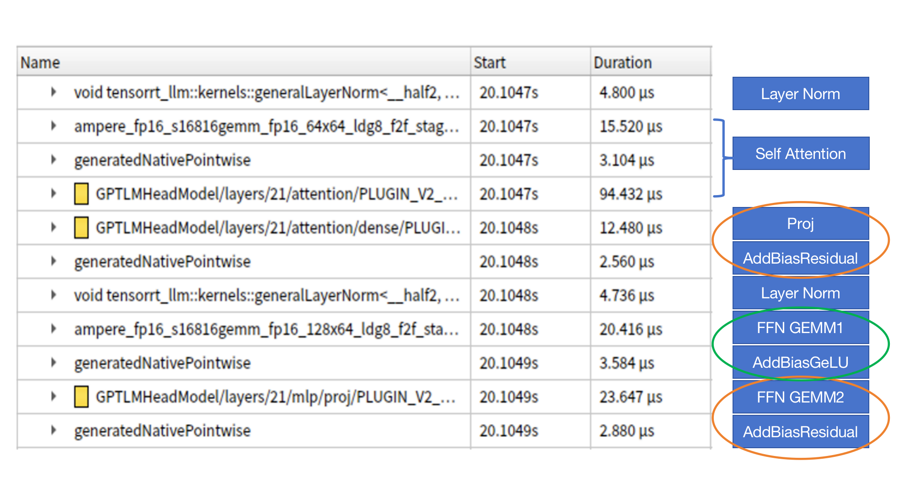

### 总述

- 选题：本次复赛选题为 [NVIDIA TensorRT Hackathon 2023](https://github.com/NVIDIA/trt-samples-for-hackathon-cn/tree/master/Hackathon2023) 选题3: 用TensorRT-LLM 优化 examples 目录下的 GPT 模型
- 优化效果：
- 在Docker里面代码编译、运行步骤的完整说明
  - 请做到只要逐行运行你给的命令，就能把代码跑起来

### 主要开发工作

#### 开发工作的难点

请在这一节里总结你的工作难点与亮点。
- 如果使用 TensorRT 进行优化，请介绍一下在模型在导出时、或用polygraphy/trtexec解析时，或在使用TensorRT中，遇到了什么问题并解决了。换句话说，针对这个模型，我们为什么需要额外的工程手段。
- 如果使用 TensorRT-LLM 进行优化，描述以下方面可供选手参考：如果搭建了新模型， 请介绍模型结构有无特别之处，在模型的搭建过程中使用了什么算子，有没有通过plugin支持的新算子。如果支持新feature，请介绍这个feature具体需要修改哪些模块才能实现。如果优化已有模型，请介绍模型性能瓶颈以及解决方法。另外还可以包含工程实现以及debug过程中的难点。

### 开发与优化过程

#### 1、分析模型耗时
在进行优化之前，首先需要定位出优化点。这个时候需要跑一些 benchmark 以及通过 nsys 对整体耗时及具体 kernel 耗时进行一些分析。

GPT 的计算过程可以将第一次计算（context）和后续自回归解码（generation）区别开来。第一次计算时为整个 input_length 个 tokens 作为输入，input_length 的大小会影响计算耗时。后续自回归解码每个请求输入为 1 个 token（此处取 beam 为 1），循环 output_length 次。用 ```Tctx``` 来标记第一次计算耗时，```Tgen``` 来标记自回归解码一个 token 的耗时。不考虑KV 累积导致 ```Tgen``` 轻微增加的情况，则整个解码的耗时 ```T = Tctx + output_length * Tgen```

#### 1.1 benchmark

使用 ```benchmarks/benchmark.py``` 跑一下 gpt_350m 模型在不同参数下的性能，

- 运行如下命令：

```python benchmark.py -m gpt_350m --mode plugin --batch_size "1;8;16;32;64" --input_output_len "64,20;128,20;64,120;128,120" --output_dir gpt2```

- 结果如下表所示：

|  batch   | input_length  | output_length | tokens_per_sec | latency(ms) |
|  ----  | ----  | ----| ---- | ---- |
| 1  | 64 | 20 | 386.56 | 51.74 |
| 8  | 64 | 20 | 2593.23 | 61.70 |
| 16  | 64 | 20 | 4384.88 |  72.98 |
| 32  | 64 | 20 | 6840.90 |  93.56 |
| 64  | 64 | 20 | 8639.60 |  148.16 |
| 1  | 128 | 20 | 373.96 | 53.48 |
| 8  | 128 | 20 | 2215.36 | 72.23 |
| 16  | 128 | 20 |  3505.70 |  91.28 |
| 32  | 128 | 20 | 4747.70 |  134.80 |
| 64  | 128 | 20 | 5722.28 |  223.69 |
| 1  | 64 | 120 | 393.02 | 305.33 |
| 8  | 64 | 120 | 2764.54 | 346.88 |
| 16  | 64 | 120 | 5002.83  |  383.78 |
| 32  | 64 | 120 | 8524.22 |  450.48 |
| 64  | 64 | 120 | 11932.40 |  643.63 |
| 1  | 128 | 120 | 382.07 | 314.08 |
| 8  | 128 | 120 | 2588.72 | 370.84 |
| 16  | 128 | 120 | 4532.15 |  423.64 |
| 32  | 128 | 120 | 7178.17 |  534.96 |
| 64  | 128 | 120 | 9635.28 |  797.07 |

从表中我们可以看出如下信息：

- batch 从 1 增加到 64 的过程中 tokens_per_sec 一直在增加，即服务的吞吐在增加。batch 由 32 增加到 64 时延迟并没有翻倍，说明整个系统并没有达到 compute-bound 的状态。原因可能在于自回归解码时计算量还不够大。上表中 beam 为 1，当 beam 增大时可能会出现 compute-bound 的情况。
- batch 从 1 变为 8 的时候，延迟只有轻微的增加。进一步说明了在 batch 很小的时候，整个系统处于一种 memory-bound 的状态。
- 在 output_length 为 20 的时候（自回归循环次数少的时候），input_length 从 60 变为 128 的时候，延迟的变化还与 batch 相关。
  - 在 batch 较小时，input_length 从 60 变为 128 对延迟影响不大。说明 batch 较小时 ```Tctx``` 部分的计算还是 memory-bound，主要耗时都花在读取权重上了。
  - 在 batch 较大时，input_length 从 60 变为 128 对延迟影响不大。说明此时 ```Tctx``` 部分的计算已经开始转变为 compute-bound。同时也说明 ```Tctx``` 在  ```T``` 中占比较大。
- 在 output_length 为 120 的时候，input_length 从 60 变为 128 对延迟的影响很小。这也说明此时即使 ```Tctx``` 变为 compute-bound，但 ```Tctx``` 在 ```T``` 中占比并不高。

##### 1.2 使用 nsys 工具来定位
可以使用 nsys 工具来验证我们得到的结论，通过可视化的 timeline 及各 kernel 的耗时来进一步定位出可优化的空间。

- 运行如下命令：

```nsys profile -o gpt2_bench python benchmark.py -m gpt_350m --mode plugin --batch_size "1;8;64" --input_output_len "64,20;128,20" --engine_dir gpt2```

- 观察不同参数下 timeline 上耗时情况

| (batch, input_len, output_len) | timeline |
| ---- | ---- |
| (1, 64, 20)|  |
| (8, 64, 20)|  |
| (64, 64, 20)|  |
| (1, 128, 20)|  |
| (8, 128, 20)|  |
| (64, 128, 20)|  |

观察 output_len 为 20 时不同 batch、input_len 下的 timeline，基本符合之前的猜想。随着 batch 变大，```Tctx``` 在整体耗时中占比越来越大，而 ```Tgen``` 的耗时并没有随着 batch 线性增长。

#### 优化点1：减少显式同步的次数
在自回归的时候，每个 step 计算结束时都会检查解码结果来判断是否需要退出循环，导致每个 step 都会有一次显式的流同步，会打断 cpu 和 gpu 的异步计算，观察 timeline 可以发现每个 step 结束之后 gpu 都会有一小段空闲。为了减少 gpu 的空闲时间，在代码中已经采取了双 context 的方案，即在同步之前提前设置好下一个 step 的运行信息，这样能有效减少 gpu 的空闲时间。


同步的目的是为了判断是否需要跳出自回归解码的循环，但仔细想一想就会发现，我们并不需要每一个 step 都判断一次是否需要跳出循环，而是可以间隔几个 step 判断一次。在此优化中，我们添加两个参数来控制同步频率：
- ```skip_step``` : 表示每次解码的前 skip_step 此循环不检查是否退出，这个参数可以统计一下线上平均输出 tokens 长度或者平均解码 step 次数来设置。由于在 batch 解码时所有的请求都需要按照 batch 中输出最长的 step 来计算，在 batch 比较大的时候 skip_step 往往可以设置得更大一些。
- ```check_step``` : 表示出了 skip_step 之外，后续每循环 check_step 次才检查一次是否要退出循环。如果设置为 1 表示每个 step 都会检查。当然这个设置也可能会导致解码循环的次数变多，极端情况下会导致多计算 ```check_step - 1``` 次。比如某个请求输出包含 41 个 tokens，在 skip_step = 0, check_step = 4 这样的设置下，会循环解码 44 次，当然这只会导致计算次数变多，不会导致解码结果出错。此时需要权衡合适的 check_step 设置，一般来说 output_len 越大加速效果越明显。

主要修改的代码 DynamicDecodeOp 的 forward 计算，原始代码中会将是否结束解码的标志保持在 ```should_stop``` (pinned memory) 中，这也导致了每个 step 都需要做流的同步。我们将逻辑改为将解码结束的请求数写到一个 ```finished_sum``` (gpu memory) 中，在 python 的循环逻辑中根据 skip_step 和 check_step 的设置来判断是否需要进行同步计算 should_stop，代码逻辑如下：
```python
if step == self.max_new_tokens - 1 \
        or (step >= scfg.skip_step and (step - scfg.skip_step) % scfg.check_step == 0):
    should_stop = self.finished_sum.cpu().item() == batch_size
else:
    should_stop = False
```

通过 nsys 来观察 skip_step=8,check_step==4 时的 timeline，可以发现 gpu 空闲有明显减少，同步次数也变少。


加速效果
| (batch, input_len, output_len) | base | skip_8_check_4 | 加速比 |
| ---- | ---- | ---- | ---- |
| (1, 64, 20)| 51.72 | 50.03 | <span style='color:red'>1.034</span> |
| (8, 64, 20)| 61.36 | 59.60 | 1.030 |
| (64, 64, 20)| 146.05 | 144.64 | 1.010 |
| (1, 128, 20)| 53.32 | 51.63 | 1.033 |
| (8, 128, 20)| 71.47| 69.90 | 1.022 |
| (64, 128, 20)| 222.42 | 220.10 | 1.011 |
| (1, 64, 120)| 305.35 | 295.67 | 1.033 |
| (8, 64, 120)| 345.49 | 337.53 | 1.024 |
| (64, 64, 120)| 634.63 | 628.59 | 1.010 |
| (1, 128, 120)| 312.75 | 303.46 | 1.031 |
| (8, 128, 120)| 367.25| 359.55 | 1.021 |
| (64, 128, 120)| 787.35 | 779.07 | 1.011 |

从表中可以看到，此方案减少的延迟与 output_len 相关，output_len 相同时无论 batch 多大，减少的延迟都是一致的。最终的效果是 output_len 越大减少的延迟越多，batch 越小加速比越大。

#### 优化点2：优化 layer norm 的计算
首先使用 nsys 来统计下在整个 pipeline 中不同 kernel 耗时占比。
``` bash
nsys profile -o gpt2_raw_v2 python benchmark.py -m gpt_350m --mode plugin --batch_size "1;8;64" --input_output_len "64,20;64,120" --engine_dir gpt2
```
从图中可以看出
- 矩阵乘法占比较大，分散调用了不同的 kernel
- attention 部分计算耗时占比我哦 21.6% 左右
- tensorrt jit 生成的 elementwise（sum 及 gelu）操作占比 为 8.9%
- layer norm 耗时占 6.4%


其中 layer norm 在 tensorrt_llm 中是通过插件来实现的，比较方便我们来进行修改优化。

通过分析 layer norm kernel 源码可以发现有如下可以优化的点：
- layer norm 的 block_size 参数设置有错误，源码中设置为 ```dim3 block(min(hidden_dim, 1024));```，但实际上在能做向量化计算时，应该设置为 ```dim3 block(min(hidden_dim / vec_size, 1024));```。GPT-medium 的 hidden_dim 为 1024。由于一个 sm 最多能同时运行 2048 个线程，如果 block 中线程数为 1024，则一个 sm 最多能同时运行 2 个 block。此时如果 block 中线程数能正确设置为 512，则一个 sm 最多能同时运行 4 个 block。A10 有 72 个 sm，在 tokens 数较多的 Tctx 阶段，错误的线程数设置对性能影响较大。
- layer norm 的通用实现在 hidden dim 较小时性能不够好。layer norm 中使用一个 CTA 来计算一行的结果，并考虑了是否使用 shared memory。但在 hidden dim 为 1024 的场景，可以使用一个 warp 来计算一行的结果，直接使用寄存器来做缓存。
- 在加载 gamma 和 beta 参数的时候可以使用 __ldg 来做 cache。

基于此，我们针对 ```hidden_dim <= 1024``` 这种情况专门实现了一个优化版本的 kernel，使用一个 warp 来计算一行，并使用寄存器来缓存数据。

加速效果 (skip=0, check=1)
| (batch, input_len, output_len) | base | layer_norm_opt | 加速比 |
| ---- | ---- | ---- | ---- |
| (1, 64, 20)| 51.72 | 51.79 | 0.998 |
| (8, 64, 20)| 61.36 | 60.55 | 1.013 |
| (64, 64, 20)| 146.05 | 141.47 | 1.032 |
| (1, 128, 20)| 53.32 | 53.30 | 1.000 |
| (8, 128, 20)| 71.47| 70.45 | 1.014 |
| (64, 128, 20)| 222.42 | 213.79 | <span style='color:red'>1.040</span> |
| (1, 64, 120)| 305.35 | 305.31 | 1.000 |
| (8, 64, 120)| 345.49 | 345.42 | 1.000 |
| (64, 64, 120)| 634.63 | 631.26 | 1.005 |
| (1, 128, 120)| 312.75 | 313.06 | 0.999 |
| (8, 128, 120)| 367.25| 366.26 | 1.003 |
| (64, 128, 120)| 787.35 | 776.98 | 1.013 |

可以看出，优化版本主要是优化了 Tctx 部分 batch 较大时的 layer norm 计算，在 Tgen 部分由于 tokens 较少，使用 warp 的方式计算时起的 block 数较少，相对使用 shared memory 时加速效果并不明显。


从统计到的耗时可以看出，layer norm 计算最大耗时从之前的 158us 降为 33us。

#### 优化点3：合并计算减少 elementwise 计算开销
在 FasterTransformer 中可以看到将各类 elementwise 操作进行了合并，但这样的合并在 tensorrt-llm 中并不容易集成。


观察上图中 GPT 一个 block 的计算逻辑调用的 kernel，可以发现 TensorRT 以及自动合并了一些 elementwise 操作，更进一步的，我们能否将这些操作和 GEMM 合并起来呢。通过观察，我们发现在 GPT 计算中包含两种计算模式：
- 图中橙色圈: GEMM + AddBias + Residual
- 图中绿色圈: GEMM + AddBias + GeLU

通过合并这些计算，有可能进一步减少 elementwise 操作的时间。在探索过程中，我们调研了 [cutlass](https://github.com/NVIDIA/cutlass) 和 [cudnn-frontend](https://github.com/NVIDIA/cudnn-frontend) 两种方案。在 cutlass 中通过添加 EpilogueOp 来在矩阵乘法之后做一些 elementwise 的操作。但在单测时发现有一些尺寸，不管设置怎样的 ```ThreadblockShape```、```WarpShape```、```InstructionShape``` 都没有拆分成两个 kernel 快。基于此选择了实测性能更好的 cudnn-frontend 方案。我们开发了两个 TensorRT 插件：
- GemmBiasAct：实现 GEMM + AddBias + GeLU 逻辑，由于 cudnn-frontend 中 ```MatMul``` 操作不支持设置 transpose，所以在模型导出和加载时 ```mlp.c_fc.weight``` 需要做一些转置的修改。另外 cudnn-frontend 需要先 build 生成 plan，执行时再用具体的数据来执行 plan，由于 build 耗时比较长，在代码中需要缓存不同参数的 plan。
- GemmBiasRes：实现了 GEMM + AddBias + Residual 逻辑。按照 GemmBiasAct 的思路来实现，但在实测中发现性能比 base 版本慢了很多，原因在于 base 版本在计算小尺寸 GEMM 的时候采用了 splitK 方案，比 cudnn 中的 GEMM 快很多。基于此我们将 ```MatMul``` 操作替换成了一个 1*1 的 ```Conv``` 操作，测试下来速度比 base 版本更快。cudnn 中并没有支持 Conv 与 GeLU 的融合，所以 GemmBiasAct 中继续采用 ```MatMul```。


对比上图中 block 内的计算与 base 版本的计算可以发现优化后的版本能有效减少 elementwise 操作的开销。

加速效果 (skip=0, check=1, 关闭 layer norm 加速)
| (batch, input_len, output_len) | base | cudnn-frontend | 加速比 |
| ---- | ---- | ---- | ---- |
| (1, 64, 20)| 51.72 | 48.81 | 1.060 |
| (8, 64, 20)| 61.36 | 57.74 | 1.063 |
| (64, 64, 20)| 146.05 | 137.44 | 1.063 |
| (1, 128, 20)| 53.32 | 50.27 | 1.061 |
| (8, 128, 20)| 71.47| 67.19 | 1.064 |
| (64, 128, 20)| 222.42 | 209.82 | 1.060 |
| (1, 64, 120)| 305.35 | 288.35 | 1.059 |
| (8, 64, 120)| 345.49 | 323.76 | 1.067 |
| (64, 64, 120)| 634.63 | 617.25 | 1.028 |
| (1, 128, 120)| 312.75 | 296.34 | 1.055 |
| (8, 128, 120)| 367.25| 346.82 | 1.059 |
| (64, 128, 120)| 787.35 | 764.64 | 1.030 |

### 优化效果

这一部分介绍你的工作在云主机上的运行效果。如果是优化模型，需要分两部分说明：

本工作针对 GPT-Medium 模型在 tensorrt-llm 上实现了三个优化点：
- 优化点1: 减少显式同步的次数
- 优化点2: 优化 layer norm 的计算
- 优化点3: 合并计算减少 elementwise 计算开销

测试命令
```bash
python benchmark.py -m gpt_350m --mode plugin --batch_size "1;8;64" --input_output_len "64,20;128,20;64,120;128,120" --engine_dir gpt2 --skip_step=8 --check_step=4
```

#### 精度
开启三个优化后，原始模型与优化模型的 Rouge score 差异(GPT-Medium)。此处延迟高是因为没有做 warmup，包含了 build plan 的时间。
```
TensorRT-LLM (total latency: 66.98257255554199 sec)
TensorRT-LLM beam 0 result
  rouge1 : 20.735151996347536
  rouge2 : 6.1022639415477835
  rougeL : 16.40108348647125
  rougeLsum : 18.184358801291715
Hugging Face (total latency: 14.055776119232178 sec)
HF beam 0 result
  rouge1 : 18.182978950152904
  rouge2 : 5.166241888544473
  rougeL : 14.851620358520162
  rougeLsum : 16.95757748412272
```

#### 性能
| (batch, input_len, output_len) | base | opt | 加速比 |
| ---- | ---- | ---- | ---- |
| (1, 64, 20)| 51.72 | 46.75 | 1.106 |
| (8, 64, 20)| 61.36 | 55.95 | 1.097 |
| (64, 64, 20)| 146.05 | 132.19 | 1.105 |
| (1, 128, 20)| 53.32 | 48.25 | 1.105 |
| (8, 128, 20)| 71.47| 64.79 | 1.103 |
| (64, 128, 20)| 222.42 | 202.71 | 1.097 |
| (1, 64, 120)| 305.35 | 278.99 | 1.094 |
| (8, 64, 120)| 345.49 | 318.35 | 1.085 |
| (64, 64, 120)| 634.63 | 604.63 | 1.050 |
| (1, 128, 120)| 312.75 | 287.21 | 1.089 |
| (8, 128, 120)| 367.25| 339.14 | 1.083 |
| (64, 128, 120)| 787.35 | 750.78 | 1.049 |

通过优化在不同的参数下获得 4.9%～10.6% 的加速。

请注意：

- 相关测试代码也需要包含在代码仓库中，可被复现。
- 请写明云主机的软件硬件环境，方便他人参考。
  - 硬件: A10 gpu, 16 核 Intel(R) Xeon(R) Platinum 8369B
  - 软件镜像: registry.cn-hangzhou.aliyuncs.com/trt-hackathon/trt-hackathon:final_v1

### Bug报告（可选）

- [TensorRT 在转换包含 Trilu 的 onnx 模型时可能会获得错误的结果](https://github.com/NVIDIA/trt-samples-for-hackathon-cn/issues/84)
- [tensorrt_llm 中 layer norm 插件的 USE_DIFF_OF_SQUARES 实现可能导致结果出现 nan](https://github.com/NVIDIA/trt-samples-for-hackathon-cn/issues/88)

### 送分题答案（可选）

#### Q: ```python3 run.py --max_output_len=8```

A: chef before moving to London in the early

#### Q:  ```python3 summarize.py --engine_dir trt_engine/gpt2/fp16/1-gpu --test_hf  --batch_size 1 --test_trt_llm  --hf_model_location=gpt2 --check_accuracy --tensorrt_llm_rouge1_threshold=14```

A:
```
TensorRT-LLM (total latency: 2.840153455734253 sec)
TensorRT-LLM beam 0 result
  rouge1 : 21.869322054781037
  rouge2 : 6.258925475911645
  rougeL : 16.755771650012953
  rougeLsum : 18.68034777724496
Hugging Face (total latency: 14.237422227859497 sec)
HF beam 0 result
  rouge1 : 18.182978950152904
  rouge2 : 5.166241888544473
  rougeL : 14.851620358520162
  rougeLsum : 16.95757748412272
```

### 经验与体会（可选）

欢迎在这里总结经验，抒发感慨。